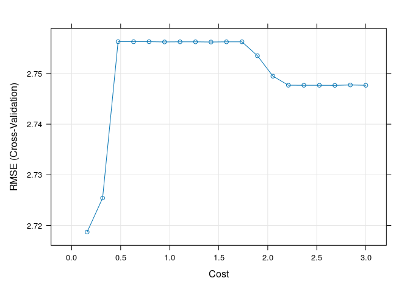
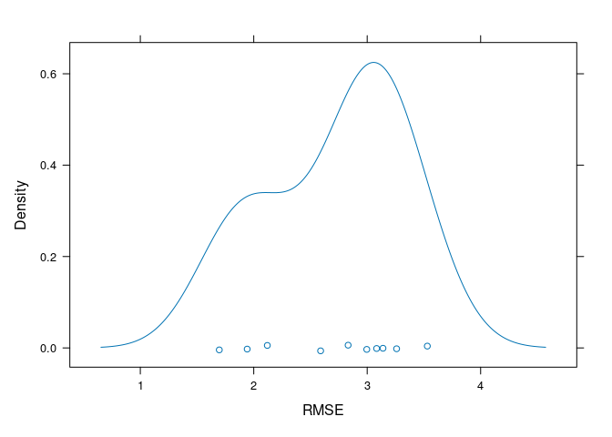
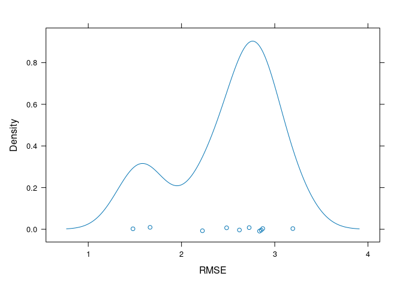
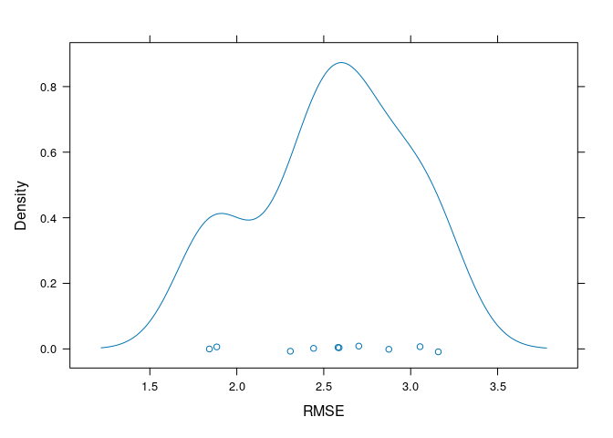

Remote sensing of wildfire burn severity; Darkwoods Conservation Area
================
SMurphy
2020-08-29

- [1. Model Designs](#1-model-designs)
  - [1.1 Import Data](#11-import-data)
  - [1.2 Model Slope](#12-model-slope)
  - [1.3 Model Training](#13-model-training)
  - [1.4 Model Tuning](#14-model-tuning)
  - [1.5 Model Validation](#15-model-validation)
- [2. Full Model List](#2-full-model-list)

## 1. Model Designs

### 1.1 Import Data

Set seed for replication to `123`. Import excel data representing
training data of burn severity classes from candidate spectral indices
sampled in-field in composite burn plots.

``` r
set.seed(123)
darkwoods_fire_plots_data <- read_excel("3.1.darkwoods_fire_ground_plots.xls")
```

### 1.2 Model Slope

``` r
ndbr_lm <- lm(CBI_total_2 ~ NDBR_2016, data = darkwoods_fire_plots_data)
ndbr_lm_resid <- resid(ndbr_lm)
plot(CBI_total_2 ~ NDBR_2016, data = darkwoods_fire_plots_data,
    ylab = "Fire severity score of composite burn plots", xlab = "NDBR",
    col = "blue")
abline(ndbr_lm, col = "red")
```

<!-- -->

### 1.3 Model Training

Splitting data 70:30 between training and test subsets according to
distribution of response variable: `CBI_total_2`.

``` r
training.samples <- createDataPartition(darkwoods_fire_plots_data$CBI_total_2,
    p = 0.7, list = FALSE)
train.data <- darkwoods_fire_plots_data[training.samples, ]
test.data <- darkwoods_fire_plots_data[-training.samples, ]
```

Training regimes set by 10K-fold cross validation with 10, 5 and no
repeats using `repeatedcv` and `cv` parameters.

``` r
model_training_10kfold_10repeat <- trainControl(method = "repeatedcv",
    number = 10, repeats = 10, savePredictions = TRUE)

model_training_10kfold_3repeat <- trainControl(method = "repeatedcv",
    number = 10, repeats = 3, savePredictions = TRUE)

model_training_10kfold <- trainControl(method = "cv", number = 10,
    savePredictions = TRUE)

# 10k-fold method
knitr::include_graphics(path = "animation.gif")
```

<!-- -->

### 1.4 Model Tuning

Apply 10K-fold-X10 training regime to test prediction of NDBR between
three candidate models including linear, non-linear support vector
machine regressions, randomForest regression tree using `svmLinear` ,
`svmRadial` , `rf` kernels. Data preprocessing included using `center`
and `scale` operations.

``` r
svm_ndbr_log_linear <- train(CBI_total_2 ~ NDBR_2016, data = train.data,
    method = "svmLinear", trControl = model_training_10kfold,
    preProcess = c("center", "scale"), tuneGrid = expand.grid(C = seq(0,
        3, length = 10)), metric = "RMSE")

svm_ndbr_log_radial <- train(CBI_total_2 ~ NDBR_2016, data = train.data,
    method = "svmRadial", trControl = model_training_10kfold,
    preProcess = c("center", "scale"), tunelength = 10)

rf_nndbr_1000trees <- train(CBI_total_2 ~ NDBR_2016, data = train.data,
    method = "rf", ntree = 1000, metric = "RMSE", trControl = model_training_10kfold,
    importance = TRUE)

# Selected kernel
svm_ndbr_log_linear_full <- train(CBI_total_2 ~ NDBR_2016, data = darkwoods_fire_plots_data,
    method = "svmLinear", trControl = model_training_10kfold,
    preProcess = c("center", "scale"), tuneGrid = expand.grid(C = seq(0,
        3, length = 10)), metric = "RMSE")
```

### 1.5 Model Validation

Compare performance of `svmLinear` model between training, test, and
full dataset, using absolute and relative MAE, RMSE, and RMSE-ratio
metrics, and `TheilU` statistic of model bias. Following results table
is taken from manuscript section 2.3.

|           |             |          |                          |            |       |       |
|:---------:|:-----------:|:--------:|:------------------------:|:----------:|:-----:|:-----:|
| **Model** |   **R2**    | **RMSE** | **RMSE<sup>ratio</sup>** | **TheilU** | **C** | **ε** |
|    NBR    | 0.879\*\*\* |   1.05   |           0.46           |   0.035    | 0.336 | 0.10  |
|  BAI2-SL  | 0.183\*\*\* |   2.61   |           1.09           |   0.307    | 1.105 | 0.10  |
|   MIRBI   | 0.551\*\*\* |   1.94   |           1.16           |   0.469    | 0.316 | 0.10  |
|    TVI    | 0.584\*\*\* |   1.88   |           1.16           |   0.432    | 0.474 | 0.10  |
|  TVI-SW   | 0.241\*\*\* |   2.54   |           1.10           |   0.343    | 0.158 | 0.10  |

``` r
svm_ndbr_pred_train <- predict(svm_ndbr_log_linear, data = train.data)
svm_ndbr_pred_test <- predict(svm_ndbr_log_linear, data = test.data)
svm_ndbr_pred_full <- predict(svm_ndbr_log_linear_full, data = darkwoods_fire_plots_data)
svm_ndbr_pred_full_r2 <- MLmetrics::R2_Score(svm_ndbr_pred_full,
    darkwoods_fire_plots_data$CBI_total_2)
svm_ndbr_pred_train_r2 <- MLmetrics::R2_Score(svm_ndbr_pred_train,
    train.data$CBI_total_2)
svm_ndbr_pred_test_r2 <- MLmetrics::R2_Score(svm_ndbr_pred_test,
    test.data$CBI_total_2)
svm_ndbr_pred_full_mae <- mae(svm_ndbr_pred_full, darkwoods_fire_plots_data$CBI_total_2)
svm_ndbr_pred_train_mae <- mae(svm_ndbr_pred_train, train.data$CBI_total_2)
svm_ndbr_pred_test_mae <- mae(svm_ndbr_pred_test, test.data$CBI_total_2)
svm_ndbr_pred_full_mae_rel <- (svm_ndbr_pred_full_mae/mean(darkwoods_fire_plots_data$CBI_total_2)) *
    100
svm_ndbr_pred_train_mae_rel <- (svm_ndbr_pred_train_mae/mean(train.data$CBI_total_2)) *
    100
svm_ndbr_pred_test_mae_rel <- (svm_ndbr_pred_test_mae/mean(test.data$CBI_total_2)) *
    100
svm_ndbr_pred_full_rmse <- rmse(svm_ndbr_pred_full, darkwoods_fire_plots_data$CBI_total_2)
svm_ndbr_pred_train_rmse <- rmse(svm_ndbr_pred_train, train.data$CBI_total_2)
svm_ndbr_pred_test_rmse <- rmse(svm_ndbr_pred_test, test.data$CBI_total_2)
svm_ndbr_pred_full_rmse_rel <- (svm_ndbr_pred_full_rmse/mean(darkwoods_fire_plots_data$CBI_total_2)) *
    100
svm_ndbr_pred_train_rmse_rel <- (svm_ndbr_pred_train_rmse/mean(train.data$CBI_total_2)) *
    100
svm_ndbr_pred_test_rmse_rel <- (svm_ndbr_pred_test_rmse/mean(test.data$CBI_total_2)) *
    100
svm_ndbr_pred_train_rmseRatio <- svm_ndbr_pred_train_rmse/svm_ndbr_pred_test_rmse
svm_ndbr_pred_test_rmseRatio <- svm_ndbr_pred_test_rmse/svm_ndbr_pred_train_rmse
svm_ndbr_full_Ubias_DescTools <- DescTools::TheilU(darkwoods_fire_plots_data$CBI_total_2,
    svm_ndbr_pred_full, type = 2)

svm_ndbr_pred_full_r2
```

    [1] 0.8822122

``` r
svm_ndbr_pred_train_r2
```

    [1] 0.9046967

``` r
svm_ndbr_pred_test_r2
```

    [1] -4.316728

``` r
svm_ndbr_pred_full_mae
```

    [1] 0.6713043

``` r
svm_ndbr_pred_train_mae
```

    [1] 0.5238902

``` r
svm_ndbr_pred_test_mae
```

    [1] 4.022415

``` r
svm_ndbr_pred_full_mae_rel
```

    [1] 15.93547

``` r
svm_ndbr_pred_train_mae_rel
```

    [1] 12.64298

``` r
svm_ndbr_pred_test_mae_rel
```

    [1] 91.56658

``` r
svm_ndbr_pred_full_rmse
```

    [1] 1.008688

``` r
svm_ndbr_pred_train_rmse
```

    [1] 0.8607236

``` r
svm_ndbr_pred_test_rmse
```

    [1] 4.774957

``` r
svm_ndbr_pred_full_rmse_rel
```

    [1] 23.94431

``` r
svm_ndbr_pred_train_rmse_rel
```

    [1] 20.77174

``` r
svm_ndbr_pred_test_rmse_rel
```

    [1] 108.6975

``` r
svm_ndbr_pred_train_rmseRatio
```

    [1] 0.1802579

``` r
svm_ndbr_pred_test_rmseRatio
```

    [1] 5.547608

``` r
svm_ndbr_full_Ubias_DescTools
```

    [1] 0.1963738

``` r
svm_ndbr_log_linear_full$finalModel
```

    Support Vector Machine object of class "ksvm" 

    SV type: eps-svr  (regression) 
     parameter : epsilon = 0.1  cost C = 0.333333333333333 

    Linear (vanilla) kernel function. 

    Number of Support Vectors : 57 

    Objective Function Value : -5.0484 
    Training error : 0.116535 

## 2. Full Model List

``` r
# model 2 - NDBR-SW
svm_ndbr_sw_linear <- train(CBI_total_2 ~ NDBR_SW2_2, data = train.data,
    method = "svmLinear", trControl = model_training_10kfold,
    preProcess = c("center", "scale"), tuneGrid = expand.grid(C = seq(0,
        3, length = 20)))

# model 3 - BAI2
svm_bai2_linear <- train(CBI_total_2 ~ BAI2_2016, data = train.data,
    method = "svmLinear", trControl = model_training_10kfold,
    preProcess = c("center", "scale"), tuneGrid = expand.grid(C = seq(0,
        3, length = 20)))

# model 4 - MIRBI
svm_mirbi_linear <- train(CBI_total_2 ~ MIRBI_2016, data = train.data,
    method = "svmLinear", trControl = model_training_10kfold,
    preProcess = c("center", "scale"), tuneGrid = expand.grid(C = seq(0,
        3, length = 20)))

# model 5 - MSAV
svm_msav_linear <- train(CBI_total_2 ~ MSAV_2016, data = train.data,
    method = "svmLinear", trControl = model_training_10kfold,
    preProcess = c("center", "scale"), tuneGrid = expand.grid(C = seq(0,
        3, length = 20)))

# model 6 - TVI
svm_tvi_linear <- train(CBI_total_2 ~ VIT2_2016, data = train.data,
    method = "svmLinear", trControl = model_training_10kfold,
    preProcess = c("center", "scale"), tuneGrid = expand.grid(C = seq(0,
        3, length = 20)))

# model 7 - TVI-SW
svm_tvi_sw_linear <- train(CBI_total_2 ~ VIRSW2_201, data = train.data,
    method = "svmLinear", trControl = model_training_10kfold,
    preProcess = c("center", "scale"), tuneGrid = expand.grid(C = seq(0,
        3, length = 20)))
```

``` r
# model 2 - NDBRSW results
summary(lm(predict(svm_ndbr_sw_linear) ~ train.data$CBI_total_2))
```


    Call:
    lm(formula = predict(svm_ndbr_sw_linear) ~ train.data$CBI_total_2)

    Residuals:
        Min      1Q  Median      3Q     Max 
    -2.1946 -0.7337 -0.1164  0.6918  2.1474 

    Coefficients:
                           Estimate Std. Error t value Pr(>|t|)    
    (Intercept)             3.40877    0.21770  15.658   <2e-16 ***
    train.data$CBI_total_2  0.08340    0.04359   1.913   0.0601 .  
    ---
    Signif. codes:  0 '***' 0.001 '**' 0.01 '*' 0.05 '.' 0.1 ' ' 1

    Residual standard error: 1.002 on 66 degrees of freedom
    Multiple R-squared:  0.05255,   Adjusted R-squared:  0.03819 
    F-statistic: 3.661 on 1 and 66 DF,  p-value: 0.06005

``` r
svm_ndbr_sw_pred_train <- predict(svm_ndbr_sw_linear, data = train.data)
svm_ndbr_sw_pred_train_mae <- mae(svm_ndbr_sw_pred_train, train.data$CBI_total_2)
svm_ndbr_sw_pred_train_mae
```

    [1] 2.294951

``` r
svm_ndbr_sw_pred_train_mae_rel <- (svm_ndbr_sw_pred_train_mae/mean(train.data$CBI_total_2)) *
    100
svm_ndbr_sw_pred_train_mae_rel
```

    [1] 55.38379

``` r
svm_ndbr_sw_pred_train_rmse <- rmse(svm_ndbr_sw_pred_train, train.data$CBI_total_2)
svm_ndbr_sw_pred_train_rmse
```

    [1] 2.767207

``` r
svm_ndbr_sw_pred_train_rmse_rel <- (svm_ndbr_sw_pred_train_rmse/mean(train.data$CBI_total_2)) *
    100
svm_ndbr_sw_pred_train_rmse_rel
```

    [1] 66.78068

``` r
svm_ndbr_sw_pred_train_R2 <- R2(svm_ndbr_sw_pred_train, train.data$CBI_total_2)
svm_ndbr_sw_pred_train_R2
```

    [1] 0.05254919

``` r
TheilU(train.data$CBI_total_2, svm_ndbr_sw_pred_train, type = 2)
```

    [1] 0.5540623

``` r
svm_ndbr_sw_train_Ubias <- DescTools::TheilU(train.data$CBI_total_2,
    svm_ndbr_sw_pred_train, type = 2)

svm_ndbr_sw_train_Ubias <- ((svm_ndbr_sw_pred_train_mae) * 68)/((svm_ndbr_sw_pred_train_mae)^2)
svm_ndbr_sw_train_Ubias
```

    [1] 29.63026

``` r
svm_ndbr_sw_pred_test <- predict(svm_ndbr_sw_linear, data = darkwoods_fire_plots_data)
svm_ndbr_sw_pred_test_rmse <- rmse(svm_ndbr_sw_pred_test, darkwoods_fire_plots_data$CBI_total_2)
svm_ndbr_sw_pred_test_rmse
```

    [1] 2.913245

``` r
svm_ndbr_sw_pred_test_rmse_rel <- (svm_ndbr_sw_pred_test_rmse/mean(darkwoods_fire_plots_data$CBI_total_2)) *
    100
svm_ndbr_sw_pred_test_rmse_rel
```

    [1] 69.15485

``` r
svm_ndbr_sw_pred_train_rmse/svm_ndbr_sw_pred_test_rmse
```

    [1] 0.9498709

``` r
svm_ndbr_sw_pred_test_rmse/svm_ndbr_sw_pred_train_rmse
```

    [1] 1.052775

``` r
svm_ndbr_sw_linear
```

    Support Vector Machines with Linear Kernel 

    68 samples
     1 predictor

    Pre-processing: centered (1), scaled (1) 
    Resampling: Cross-Validated (10 fold) 
    Summary of sample sizes: 61, 62, 61, 61, 61, 62, ... 
    Resampling results across tuning parameters:

      C          RMSE      Rsquared   MAE     
      0.0000000       NaN        NaN       NaN
      0.1578947  2.718691  0.2040276  2.324704
      0.3157895  2.725407  0.2040276  2.331462
      0.4736842  2.756288  0.2040276  2.333996
      0.6315789  2.756288  0.2040276  2.333996
      0.7894737  2.756288  0.2040276  2.334002
      0.9473684  2.756245  0.2040276  2.333969
      1.1052632  2.756269  0.2040276  2.333993
      1.2631579  2.756266  0.2040276  2.333990
      1.4210526  2.756229  0.2040276  2.333963
      1.5789474  2.756267  0.2040276  2.333989
      1.7368421  2.756269  0.2040276  2.333988
      1.8947368  2.753512  0.2040276  2.332823
      2.0526316  2.749483  0.2040276  2.330864
      2.2105263  2.747695  0.2040276  2.329871
      2.3684211  2.747683  0.2040276  2.329866
      2.5263158  2.747683  0.2040276  2.329866
      2.6842105  2.747668  0.2040276  2.329859
      2.8421053  2.747742  0.2040276  2.329917
      3.0000000  2.747683  0.2040276  2.329871

    RMSE was used to select the optimal model using the smallest value.
    The final value used for the model was C = 0.1578947.

``` r
plot(svm_ndbr_sw_linear)
```

<!-- -->

``` r
densityplot(svm_ndbr_sw_linear)
```

<!-- -->

``` r
svm_ndbr_sw_linear$finalModel
```

    Support Vector Machine object of class "ksvm" 

    SV type: eps-svr  (regression) 
     parameter : epsilon = 0.1  cost C = 0.157894736842105 

    Linear (vanilla) kernel function. 

    Number of Support Vectors : 66 

    Objective Function Value : -7.77 
    Training error : 0.970576 

``` r
# model 3 - BAI2 results
summary(lm(predict(svm_bai2_linear) ~ train.data$CBI_total_2))
```


    Call:
    lm(formula = predict(svm_bai2_linear) ~ train.data$CBI_total_2)

    Residuals:
        Min      1Q  Median      3Q     Max 
    -3.7708 -0.2785  0.2322  0.9280  1.9086 

    Coefficients:
                           Estimate Std. Error t value Pr(>|t|)    
    (Intercept)             3.48741    0.28138  12.394  < 2e-16 ***
    train.data$CBI_total_2  0.23558    0.05634   4.181 8.72e-05 ***
    ---
    Signif. codes:  0 '***' 0.001 '**' 0.01 '*' 0.05 '.' 0.1 ' ' 1

    Residual standard error: 1.295 on 66 degrees of freedom
    Multiple R-squared:  0.2094,    Adjusted R-squared:  0.1975 
    F-statistic: 17.48 on 1 and 66 DF,  p-value: 8.719e-05

``` r
svm_bai2_pred_train <- predict(svm_bai2_linear, data = train.data)
svm_bai2_pred_train_mae <- mae(svm_bai2_pred_train, train.data$CBI_total_2)
svm_bai2_pred_train_mae
```

    [1] 2.080891

``` r
svm_bai2_pred_train_mae_rel <- (svm_bai2_pred_train_mae/mean(train.data$CBI_total_2)) *
    100
svm_bai2_pred_train_mae_rel
```

    [1] 50.2179

``` r
svm_bai2_pred_train_rmse <- rmse(svm_bai2_pred_train, train.data$CBI_total_2)
svm_bai2_pred_train_rmse
```

    [1] 2.504634

``` r
svm_bai2_pred_train_rmse_rel <- (svm_bai2_pred_train_rmse/mean(train.data$CBI_total_2)) *
    100
svm_bai2_pred_train_rmse_rel
```

    [1] 60.44403

``` r
svm_bai2_pred_train_R2 <- R2(svm_bai2_pred_train, train.data$CBI_total_2)
svm_bai2_pred_train_R2
```

    [1] 0.2094349

``` r
TheilU(train.data$CBI_total_2, svm_bai2_pred_train, type = 2)
```

    [1] 0.5014887

``` r
svm_bai2_train_Ubias <- ((svm_bai2_pred_train_mae) * 68)/((svm_bai2_pred_train_mae)^2)
svm_bai2_train_Ubias
```

    [1] 32.67831

``` r
svm_bai2_pred_test <- predict(svm_bai2_linear, data = darkwoods_fire_plots_data)
svm_bai2_pred_test_rmse <- rmse(svm_bai2_pred_test, darkwoods_fire_plots_data$CBI_total_2)
svm_bai2_pred_test_rmse
```

    [1] 3.261599

``` r
svm_bai2_pred_test_rmse_rel <- (svm_bai2_pred_test_rmse/mean(darkwoods_fire_plots_data$CBI_total_2)) *
    100
svm_bai2_pred_test_rmse_rel
```

    [1] 77.4241

``` r
svm_bai2_pred_train_rmse/svm_bai2_pred_test_rmse
```

    [1] 0.7679159

``` r
svm_bai2_pred_test_rmse/svm_bai2_pred_train_rmse
```

    [1] 1.302226

``` r
svm_bai2_linear
```

    Support Vector Machines with Linear Kernel 

    68 samples
     1 predictor

    Pre-processing: centered (1), scaled (1) 
    Resampling: Cross-Validated (10 fold) 
    Summary of sample sizes: 62, 63, 62, 60, 60, 62, ... 
    Resampling results across tuning parameters:

      C          RMSE      Rsquared   MAE     
      0.0000000       NaN        NaN       NaN
      0.1578947  2.497105  0.3535304  2.151404
      0.3157895  2.496210  0.3535304  2.147108
      0.4736842  2.495418  0.3535304  2.145369
      0.6315789  2.496022  0.3535304  2.139129
      0.7894737  2.496032  0.3535304  2.139131
      0.9473684  2.496022  0.3535304  2.139129
      1.1052632  2.496013  0.3535304  2.139081
      1.2631579  2.510650  0.3535304  2.156239
      1.4210526  2.510635  0.3535304  2.156236
      1.5789474  2.510635  0.3535304  2.156236
      1.7368421  2.510635  0.3535304  2.156236
      1.8947368  2.510680  0.3535304  2.156271
      2.0526316  2.510635  0.3535304  2.156236
      2.2105263  2.510635  0.3535304  2.156236
      2.3684211  2.510810  0.3535304  2.156590
      2.5263158  2.511150  0.3535304  2.157354
      2.6842105  2.511137  0.3535304  2.157346
      2.8421053  2.511137  0.3535304  2.157346
      3.0000000  2.511137  0.3535304  2.157346

    RMSE was used to select the optimal model using the smallest value.
    The final value used for the model was C = 0.4736842.

``` r
plot(svm_bai2_linear)
```

<!-- -->

``` r
densityplot(svm_bai2_linear)
```

<!-- -->

``` r
svm_bai2_linear$finalModel
```

    Support Vector Machine object of class "ksvm" 

    SV type: eps-svr  (regression) 
     parameter : epsilon = 0.1  cost C = 0.473684210526316 

    Linear (vanilla) kernel function. 

    Number of Support Vectors : 66 

    Objective Function Value : -20.8218 
    Training error : 0.795124 

``` r
plot(svm_bai2_linear)
```

<!-- -->

``` r
# model 4 - MIRBI results
summary(lm(predict(svm_mirbi_linear) ~ train.data$CBI_total_2))
```


    Call:
    lm(formula = predict(svm_mirbi_linear) ~ train.data$CBI_total_2)

    Residuals:
        Min      1Q  Median      3Q     Max 
    -4.2389 -0.8579  0.3350  0.9567  2.8901 

    Coefficients:
                           Estimate Std. Error t value Pr(>|t|)    
    (Intercept)             1.93938    0.30551   6.348  2.3e-08 ***
    train.data$CBI_total_2  0.54280    0.06117   8.873  7.3e-13 ***
    ---
    Signif. codes:  0 '***' 0.001 '**' 0.01 '*' 0.05 '.' 0.1 ' ' 1

    Residual standard error: 1.406 on 66 degrees of freedom
    Multiple R-squared:  0.544, Adjusted R-squared:  0.5371 
    F-statistic: 78.74 on 1 and 66 DF,  p-value: 7.298e-13

``` r
svm_mirbi_pred_train <- predict(svm_mirbi_linear, data = train.data)
svm_mirbi_pred_train_mae <- mae(svm_mirbi_pred_train, train.data$CBI_total_2)
svm_mirbi_pred_train_mae
```

    [1] 1.3871

``` r
svm_mirbi_pred_train_mae_rel <- (svm_mirbi_pred_train_mae/mean(train.data$CBI_total_2)) *
    100
svm_mirbi_pred_train_mae_rel
```

    [1] 33.47472

``` r
svm_mirbi_pred_train_rmse <- rmse(svm_mirbi_pred_train, train.data$CBI_total_2)
svm_mirbi_pred_train_rmse
```

    [1] 1.883277

``` r
svm_mirbi_pred_train_rmse_rel <- (svm_mirbi_pred_train_rmse/mean(train.data$CBI_total_2)) *
    100
svm_mirbi_pred_train_rmse_rel
```

    [1] 45.4489

``` r
svm_mirbi_pred_train_R2 <- R2(svm_mirbi_pred_train, train.data$CBI_total_2)
svm_mirbi_pred_train_R2
```

    [1] 0.5440053

``` r
TheilU(train.data$CBI_total_2, svm_mirbi_pred_train, type = 2)
```

    [1] 0.377078

``` r
svm_mirbi_train_Ubias <- ((svm_mirbi_pred_train_mae) * 68)/((svm_mirbi_pred_train_mae)^2)
svm_mirbi_train_Ubias
```

    [1] 49.02314

``` r
svm_mirbi_pred_test <- predict(svm_mirbi_linear, data = darkwoods_fire_plots_data)
svm_mirbi_pred_test_rmse <- rmse(svm_mirbi_pred_test, darkwoods_fire_plots_data$CBI_total_2)
svm_mirbi_pred_test_rmse
```

    [1] 3.421022

``` r
svm_mirbi_pred_test_rmse_rel <- (svm_mirbi_pred_test_rmse/mean(darkwoods_fire_plots_data$CBI_total_2)) *
    100
svm_mirbi_pred_test_rmse_rel
```

    [1] 81.2085

``` r
svm_mirbi_pred_train_rmse/svm_mirbi_pred_test_rmse
```

    [1] 0.5505013

``` r
svm_mirbi_pred_test_rmse/svm_mirbi_pred_train_rmse
```

    [1] 1.816526

``` r
svm_mirbi_linear
```

    Support Vector Machines with Linear Kernel 

    68 samples
     1 predictor

    Pre-processing: centered (1), scaled (1) 
    Resampling: Cross-Validated (10 fold) 
    Summary of sample sizes: 61, 60, 60, 62, 60, 60, ... 
    Resampling results across tuning parameters:

      C          RMSE      Rsquared   MAE     
      0.0000000       NaN        NaN       NaN
      0.1578947  1.802346  0.6379662  1.427605
      0.3157895  1.803264  0.6379662  1.431911
      0.4736842  1.802172  0.6379662  1.430893
      0.6315789  1.801566  0.6379662  1.430789
      0.7894737  1.801634  0.6379662  1.430857
      0.9473684  1.801739  0.6379662  1.430971
      1.1052632  1.800109  0.6379662  1.428635
      1.2631579  1.800231  0.6379662  1.428716
      1.4210526  1.802228  0.6379662  1.430441
      1.5789474  1.801768  0.6379662  1.430125
      1.7368421  1.804024  0.6379662  1.434333
      1.8947368  1.804169  0.6379662  1.434657
      2.0526316  1.804120  0.6379662  1.434612
      2.2105263  1.804156  0.6379662  1.434646
      2.3684211  1.804120  0.6379662  1.434590
      2.5263158  1.804213  0.6379662  1.434691
      2.6842105  1.804163  0.6379662  1.434650
      2.8421053  1.804576  0.6379662  1.434907
      3.0000000  1.808693  0.6379662  1.437331

    RMSE was used to select the optimal model using the smallest value.
    The final value used for the model was C = 1.105263.

``` r
plot(svm_mirbi_linear)
```

<!-- -->

``` r
densityplot(svm_mirbi_linear)
```

<!-- -->

``` r
svm_mirbi_linear$finalModel
```

    Support Vector Machine object of class "ksvm" 

    SV type: eps-svr  (regression) 
     parameter : epsilon = 0.1  cost C = 1.10526315789474 

    Linear (vanilla) kernel function. 

    Number of Support Vectors : 62 

    Objective Function Value : -30.2531 
    Training error : 0.449547 

``` r
plot(svm_mirbi_linear)
```

<!-- -->

``` r
# model 5 - MSAV results
summary(lm(predict(svm_msav_linear) ~ train.data$CBI_total_2))
```


    Call:
    lm(formula = predict(svm_msav_linear) ~ train.data$CBI_total_2)

    Residuals:
        Min      1Q  Median      3Q     Max 
    -1.6722 -0.9243 -0.0853  0.6957  3.3895 

    Coefficients:
                           Estimate Std. Error t value Pr(>|t|)    
    (Intercept)              3.6308     0.2362  15.370  < 2e-16 ***
    train.data$CBI_total_2   0.1739     0.0473   3.676 0.000477 ***
    ---
    Signif. codes:  0 '***' 0.001 '**' 0.01 '*' 0.05 '.' 0.1 ' ' 1

    Residual standard error: 1.087 on 66 degrees of freedom
    Multiple R-squared:   0.17, Adjusted R-squared:  0.1574 
    F-statistic: 13.51 on 1 and 66 DF,  p-value: 0.000477

``` r
svm_msav_pred_train <- predict(svm_msav_linear, data = train.data)
svm_msav_pred_train_mae <- mae(svm_msav_pred_train, train.data$CBI_total_2)
svm_msav_pred_train_mae
```

    [1] 2.24269

``` r
svm_msav_pred_train_mae_rel <- (svm_msav_pred_train_mae/mean(train.data$CBI_total_2)) *
    100
svm_msav_pred_train_mae_rel
```

    [1] 54.12257

``` r
svm_msav_pred_train_rmse <- rmse(svm_msav_pred_train, train.data$CBI_total_2)
svm_msav_pred_train_rmse
```

    [1] 2.548744

``` r
svm_msav_pred_train_rmse_rel <- (svm_msav_pred_train_rmse/mean(train.data$CBI_total_2)) *
    100
svm_msav_pred_train_rmse_rel
```

    [1] 61.50855

``` r
svm_msav_pred_train_R2 <- R2(svm_msav_pred_train, train.data$CBI_total_2)
svm_msav_pred_train_R2
```

    [1] 0.1699657

``` r
TheilU(train.data$CBI_total_2, svm_msav_pred_train, type = 2)
```

    [1] 0.5103207

``` r
svm_msav_train_Ubias <- ((svm_msav_pred_train_mae) * 68)/((svm_msav_pred_train_mae)^2)
svm_msav_train_Ubias
```

    [1] 30.32073

``` r
svm_msav_pred_test <- predict(svm_msav_linear, data = darkwoods_fire_plots_data)
svm_msav_pred_test_rmse <- rmse(svm_msav_pred_test, darkwoods_fire_plots_data$CBI_total_2)
svm_msav_pred_test_rmse
```

    [1] 3.091682

``` r
svm_msav_pred_test_rmse_rel <- (svm_msav_pred_test_rmse/mean(darkwoods_fire_plots_data$CBI_total_2)) *
    100
svm_msav_pred_test_rmse_rel
```

    [1] 73.3906

``` r
svm_msav_pred_train_rmse/svm_msav_pred_test_rmse
```

    [1] 0.8243875

``` r
svm_msav_pred_test_rmse/svm_msav_pred_train_rmse
```

    [1] 1.213022

``` r
svm_msav_linear
```

    Support Vector Machines with Linear Kernel 

    68 samples
     1 predictor

    Pre-processing: centered (1), scaled (1) 
    Resampling: Cross-Validated (10 fold) 
    Summary of sample sizes: 61, 62, 61, 61, 61, 61, ... 
    Resampling results across tuning parameters:

      C          RMSE      Rsquared  MAE     
      0.0000000       NaN      NaN        NaN
      0.1578947  2.543568  0.28233   2.295357
      0.3157895  2.544848  0.28233   2.303846
      0.4736842  2.544848  0.28233   2.303846
      0.6315789  2.544934  0.28233   2.302252
      0.7894737  2.544934  0.28233   2.302252
      0.9473684  2.547667  0.28233   2.303020
      1.1052632  2.547667  0.28233   2.303020
      1.2631579  2.547667  0.28233   2.303020
      1.4210526  2.547667  0.28233   2.303020
      1.5789474  2.547667  0.28233   2.303020
      1.7368421  2.547667  0.28233   2.303020
      1.8947368  2.547667  0.28233   2.303020
      2.0526316  2.547667  0.28233   2.303020
      2.2105263  2.547667  0.28233   2.303020
      2.3684211  2.547667  0.28233   2.303020
      2.5263158  2.547667  0.28233   2.303020
      2.6842105  2.547667  0.28233   2.303020
      2.8421053  2.547667  0.28233   2.303020
      3.0000000  2.547667  0.28233   2.303020

    RMSE was used to select the optimal model using the smallest value.
    The final value used for the model was C = 0.1578947.

``` r
plot(svm_msav_linear)
```

<!-- -->

``` r
densityplot(svm_msav_linear)
```

<!-- -->

``` r
svm_msav_linear$finalModel
```

    Support Vector Machine object of class "ksvm" 

    SV type: eps-svr  (regression) 
     parameter : epsilon = 0.1  cost C = 0.157894736842105 

    Linear (vanilla) kernel function. 

    Number of Support Vectors : 65 

    Objective Function Value : -7.6244 
    Training error : 0.823377 

``` r
plot(svm_msav_linear)
```

<!-- -->

``` r
# model 6 - TVI results
summary(lm(predict(svm_tvi_linear) ~ train.data$CBI_total_2))
```


    Call:
    lm(formula = predict(svm_tvi_linear) ~ train.data$CBI_total_2)

    Residuals:
        Min      1Q  Median      3Q     Max 
    -2.2991 -0.8968 -0.1297  0.7738  4.0474 

    Coefficients:
                           Estimate Std. Error t value Pr(>|t|)    
    (Intercept)             2.23292    0.28653   7.793 6.22e-11 ***
    train.data$CBI_total_2  0.50138    0.05737   8.739 1.26e-12 ***
    ---
    Signif. codes:  0 '***' 0.001 '**' 0.01 '*' 0.05 '.' 0.1 ' ' 1

    Residual standard error: 1.319 on 66 degrees of freedom
    Multiple R-squared:  0.5364,    Adjusted R-squared:  0.5294 
    F-statistic: 76.38 on 1 and 66 DF,  p-value: 1.264e-12

``` r
svm_tvi_pred_train <- predict(svm_tvi_linear, data = train.data)
svm_tvi_pred_train_mae <- mae(svm_tvi_pred_train, train.data$CBI_total_2)
svm_tvi_pred_train_mae
```

    [1] 1.64125

``` r
svm_tvi_pred_train_mae_rel <- (svm_tvi_pred_train_mae/mean(train.data$CBI_total_2)) *
    100
svm_tvi_pred_train_mae_rel
```

    [1] 39.60809

``` r
svm_tvi_pred_train_rmse <- rmse(svm_tvi_pred_train, train.data$CBI_total_2)
svm_tvi_pred_train_rmse
```

    [1] 1.910272

``` r
svm_tvi_pred_train_rmse_rel <- (svm_tvi_pred_train_rmse/mean(train.data$CBI_total_2)) *
    100
svm_tvi_pred_train_rmse_rel
```

    [1] 46.10036

``` r
svm_tvi_pred_train_R2 <- R2(svm_tvi_pred_train, train.data$CBI_total_2)
svm_tvi_pred_train_R2
```

    [1] 0.5364397

``` r
TheilU(train.data$CBI_total_2, svm_tvi_pred_train, type = 2)
```

    [1] 0.3824829

``` r
svm_tvi_train_Ubias <- ((svm_tvi_pred_train_mae) * 68)/((svm_tvi_pred_train_mae)^2)
svm_tvi_train_Ubias
```

    [1] 41.43184

``` r
svm_tvi_pred_test <- predict(svm_tvi_linear, data = darkwoods_fire_plots_data)
svm_tvi_pred_test_rmse <- rmse(svm_tvi_pred_test, darkwoods_fire_plots_data$CBI_total_2)
svm_tvi_pred_test_rmse
```

    [1] 3.439511

``` r
svm_tvi_pred_test_rmse_rel <- (svm_tvi_pred_test_rmse/mean(darkwoods_fire_plots_data$CBI_total_2)) *
    100
svm_tvi_pred_test_rmse_rel
```

    [1] 81.64739

``` r
svm_tvi_pred_train_rmse/svm_tvi_pred_test_rmse
```

    [1] 0.5553904

``` r
svm_tvi_pred_test_rmse/svm_tvi_pred_train_rmse
```

    [1] 1.800535

``` r
svm_tvi_linear
```

    Support Vector Machines with Linear Kernel 

    68 samples
     1 predictor

    Pre-processing: centered (1), scaled (1) 
    Resampling: Cross-Validated (10 fold) 
    Summary of sample sizes: 62, 61, 61, 60, 60, 63, ... 
    Resampling results across tuning parameters:

      C          RMSE      Rsquared   MAE     
      0.0000000       NaN        NaN       NaN
      0.1578947  1.950356  0.6349996  1.709669
      0.3157895  1.960512  0.6349996  1.723443
      0.4736842  1.959892  0.6349996  1.721897
      0.6315789  1.964540  0.6349996  1.727960
      0.7894737  1.967339  0.6349996  1.730148
      0.9473684  1.967347  0.6349996  1.730150
      1.1052632  1.967348  0.6349996  1.730178
      1.2631579  1.968587  0.6349996  1.729028
      1.4210526  1.968587  0.6349996  1.729028
      1.5789474  1.968421  0.6349996  1.729307
      1.7368421  1.968387  0.6349996  1.729135
      1.8947368  1.968422  0.6349996  1.729201
      2.0526316  1.968389  0.6349996  1.729128
      2.2105263  1.968405  0.6349996  1.729136
      2.3684211  1.968306  0.6349996  1.729026
      2.5263158  1.965546  0.6349996  1.725820
      2.6842105  1.965546  0.6349996  1.725820
      2.8421053  1.965572  0.6349996  1.725866
      3.0000000  1.965551  0.6349996  1.725843

    RMSE was used to select the optimal model using the smallest value.
    The final value used for the model was C = 0.1578947.

``` r
plot(svm_tvi_linear)
```

<!-- -->

``` r
densityplot(svm_tvi_linear)
```

<!-- -->

``` r
svm_tvi_linear$finalModel
```

    Support Vector Machine object of class "ksvm" 

    SV type: eps-svr  (regression) 
     parameter : epsilon = 0.1  cost C = 0.157894736842105 

    Linear (vanilla) kernel function. 

    Number of Support Vectors : 62 

    Objective Function Value : -5.4886 
    Training error : 0.462526 

``` r
plot(svm_tvi_linear)
```

<!-- -->

``` r
# model 7 - TVI-SW results
summary(lm(predict(svm_tvi_sw_linear) ~ train.data$CBI_total_2))
```


    Call:
    lm(formula = predict(svm_tvi_sw_linear) ~ train.data$CBI_total_2)

    Residuals:
        Min      1Q  Median      3Q     Max 
    -3.8173 -1.0741  0.1161  1.1070  2.3619 

    Coefficients:
                           Estimate Std. Error t value Pr(>|t|)    
    (Intercept)             2.82547    0.30408   9.292 1.32e-13 ***
    train.data$CBI_total_2  0.32438    0.06088   5.328 1.29e-06 ***
    ---
    Signif. codes:  0 '***' 0.001 '**' 0.01 '*' 0.05 '.' 0.1 ' ' 1

    Residual standard error: 1.4 on 66 degrees of freedom
    Multiple R-squared:  0.3008,    Adjusted R-squared:  0.2902 
    F-statistic: 28.39 on 1 and 66 DF,  p-value: 1.29e-06

``` r
svm_tvi_sw_pred_train <- predict(svm_tvi_sw_linear, data = train.data)
svm_tvi_sw_pred_train_mae <- mae(svm_tvi_sw_pred_train, train.data$CBI_total_2)
svm_tvi_sw_pred_train_mae
```

    [1] 1.806979

``` r
svm_tvi_sw_pred_train_mae_rel <- (svm_tvi_sw_pred_train_mae/mean(train.data$CBI_total_2)) *
    100
svm_tvi_sw_pred_train_mae_rel
```

    [1] 43.60762

``` r
svm_tvi_sw_pred_train_rmse <- rmse(svm_tvi_sw_pred_train, train.data$CBI_total_2)
svm_tvi_sw_pred_train_rmse
```

    [1] 2.334681

``` r
svm_tvi_sw_pred_train_rmse_rel <- (svm_tvi_sw_pred_train_rmse/mean(train.data$CBI_total_2)) *
    100
svm_tvi_sw_pred_train_rmse_rel
```

    [1] 56.34259

``` r
svm_tvi_sw_pred_train_R2 <- R2(svm_tvi_sw_pred_train, train.data$CBI_total_2)
svm_tvi_sw_pred_train_R2
```

    [1] 0.3007533

``` r
TheilU(train.data$CBI_total_2, svm_tvi_sw_pred_train, type = 2)
```

    [1] 0.4674601

``` r
svm_tvi_sw_train_Ubias <- ((svm_tvi_sw_pred_train_mae) * 68)/((svm_tvi_sw_pred_train_mae)^2)
svm_tvi_sw_train_Ubias
```

    [1] 37.63186

``` r
svm_tvi_sw_pred_test <- predict(svm_tvi_sw_linear, data = darkwoods_fire_plots_data)
svm_tvi_sw_pred_test_rmse <- rmse(svm_tvi_sw_pred_test, darkwoods_fire_plots_data$CBI_total_2)
svm_tvi_sw_pred_test_rmse
```

    [1] 3.242471

``` r
svm_tvi_sw_pred_test_rmse_rel <- (svm_tvi_sw_pred_test_rmse/mean(darkwoods_fire_plots_data$CBI_total_2)) *
    100
svm_tvi_sw_pred_test_rmse_rel
```

    [1] 76.97004

``` r
svm_tvi_sw_pred_train_rmse/svm_tvi_sw_pred_test_rmse
```

    [1] 0.7200314

``` r
svm_tvi_sw_pred_test_rmse/svm_tvi_sw_pred_train_rmse
```

    [1] 1.388828

``` r
svm_tvi_sw_linear
```

    Support Vector Machines with Linear Kernel 

    68 samples
     1 predictor

    Pre-processing: centered (1), scaled (1) 
    Resampling: Cross-Validated (10 fold) 
    Summary of sample sizes: 60, 60, 60, 61, 61, 62, ... 
    Resampling results across tuning parameters:

      C          RMSE      Rsquared  MAE     
      0.0000000       NaN       NaN       NaN
      0.1578947  2.297153  0.396146  1.849692
      0.3157895  2.298457  0.396146  1.851282
      0.4736842  2.304871  0.396146  1.847169
      0.6315789  2.305587  0.396146  1.849281
      0.7894737  2.304099  0.396146  1.847315
      0.9473684  2.313694  0.396146  1.860001
      1.1052632  2.313672  0.396146  1.859977
      1.2631579  2.312657  0.396146  1.859622
      1.4210526  2.312658  0.396146  1.859631
      1.5789474  2.314405  0.396146  1.853914
      1.7368421  2.314410  0.396146  1.853921
      1.8947368  2.314410  0.396146  1.853921
      2.0526316  2.314410  0.396146  1.853921
      2.2105263  2.314410  0.396146  1.853921
      2.3684211  2.314414  0.396146  1.853927
      2.5263158  2.314471  0.396146  1.853917
      2.6842105  2.314410  0.396146  1.853921
      2.8421053  2.314410  0.396146  1.853921
      3.0000000  2.314686  0.396146  1.853845

    RMSE was used to select the optimal model using the smallest value.
    The final value used for the model was C = 0.1578947.

``` r
plot(svm_tvi_sw_linear)
```

<!-- -->

``` r
densityplot(svm_tvi_sw_linear)
```

<!-- -->

``` r
svm_tvi_sw_linear$finalModel
```

    Support Vector Machine object of class "ksvm" 

    SV type: eps-svr  (regression) 
     parameter : epsilon = 0.1  cost C = 0.157894736842105 

    Linear (vanilla) kernel function. 

    Number of Support Vectors : 62 

    Objective Function Value : -6.0505 
    Training error : 0.690878 
